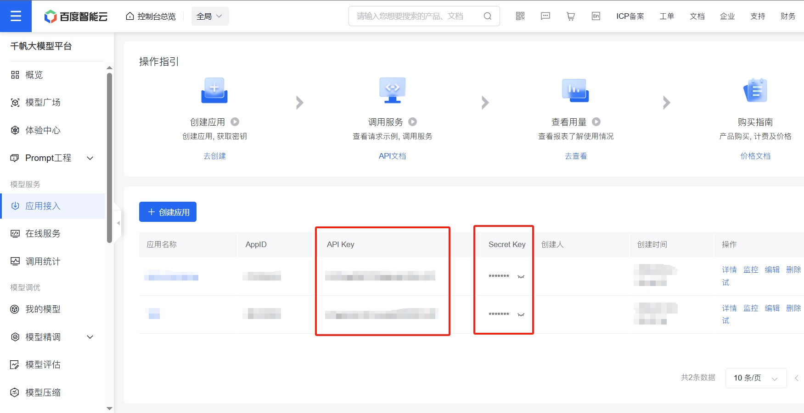

# Experience-Generator
学习心得生成器

[toc]

## Todo List

- [x] 对 PDF 的解析支持
- [x] 对 Word 的解析支持
- [ ] 对 Word 的进阶解析支持
- [x] 对 Markdown、纯文本的解析支持
- [ ] 对 Markdown 的进阶解析支持
- [x] 支持：百度 Ernie 系列 API
- [x] 支持：OpenAI 格式 API
- [ ] 支持：智谱格式 API
- [ ] 支持：直接写入 Word 文档（BUAA 独占）
- [ ] 支持：根据要求完成文档
- [ ] 支持：文档扩充化（目前为半成品）

## 如何使用

### Step 1：确定模型

#### 1. 百度 Ernie（文心一言）

百度的 ernie 两个轻量级模型宣布免费啦，直接狠狠调用（测试了一下，并发能到 50，RPM ≤ 100）。

先去百度千帆大模型平台：[百度智能云控制台 (baidu.com)](https://console.bce.baidu.com/qianfan/overview)，在侧边栏的【模型服务-应用接入】中，选择创建应用，随便填一下完成。

获取 API Key 和 Secret Key，填入 `config/config.json` 的 `ernie` 字段，并注意 `chosen_model` 为 `ernie`。

#### 2. OpenAI 格式

##### 2.1 OpenAI 原生

按照[官网教程](https://platform.openai.com/docs/quickstart)，在 `config/config.json` 的 `openai` 字段填入 `api_key` 即可，注意 `chosen_model` 为 `openai`，且需要**网络畅通**。

##### 2.2 中转代理站 / 兼容 OpenAI 的网站

代理站一般都有教程，api_key 和原生一样填入，主要需要在 `config/config.json` 的 `openai` 字段修改 `base_url`，即改为代理站提供的 `base_url`。

兼容 OpenAI 的网站也很多，包括[通义千问](https://help.aliyun.com/zh/dashscope/developer-reference/compatibility-of-openai-with-dashscope/)、[Together.ai](https://docs.together.ai/docs/openai-api-compatibility) 等。同样修改 `base_url` 和 `api_key` 即可。

##### 2.3 Ollama / 本地 OpenAI 格式部署

类似于 Ollama 本地部署模型，只要兼容 OpenAI 格式，均可以通过修改 `base_url` 和 `api_key` 的方式调用，例如 Ollama：[OpenAI compatibility · Ollama Blog](https://ollama.com/blog/openai-compatibility)。

#### Step 2：安装依赖

推荐使用虚拟环境。

请检查依赖是否满足 `requirements.txt`，若不满足，执行 `pip install -r requirements.txt`。

#### Step 3：准备待学习的文本

在 `data` 下，放入需要学习的文本。不用在意文件组织格式，代码会递归获取 `data` 下所有目标文件。

目前支持：`.pdf`、`.doc/.docx`、`.md/.markdown`、`.txt`。

#### Step 4：运行

在主目录下，确定环境依赖无误，执行 `python main.py` 即可等待生成。
